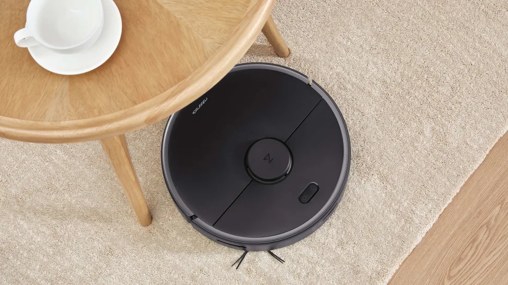
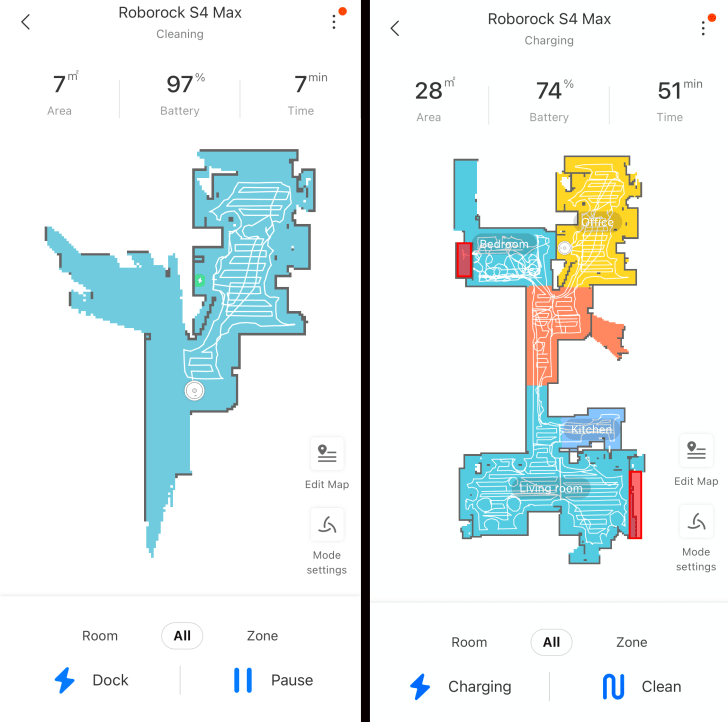
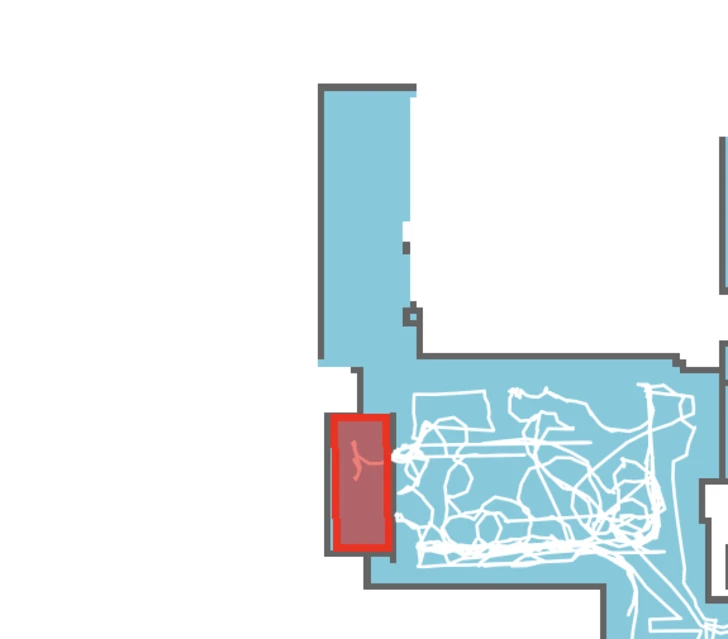
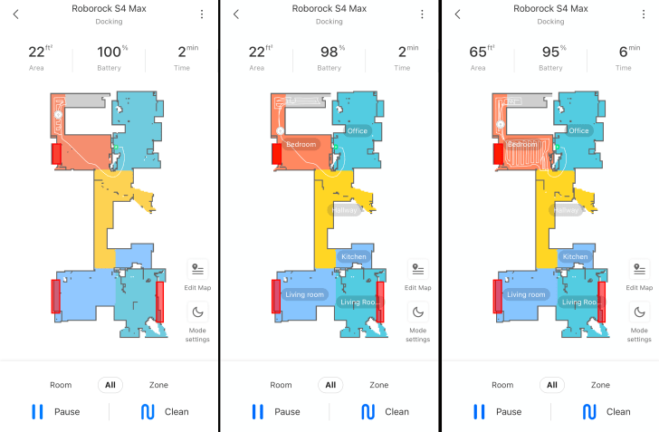

If there’s one thing that’s become clear during the coronavirus pandemic, it’s how dirty a home can get when you and your family are spending basically 24/7 inside. In our house, dishes, dust bunnies, and fur from our two cats (don’t even get me started on the fur, which even pre-pandemic couldn’t be tamed without frequent vacuuming!) just kept piling up, adding to our general stress. So when Roborock offered to send their S4 Max robot vacuum to test, I jumped at the opportunity. I’d never had a robot vacuum before—it can be hard to justify the expense without knowing if one will truly work for you—so I was eager to try it out.

SETTING UP THE ROBOROCK S4 MAX
While you can use the Roborock S4 Max by simply hitting the "clean" button, you’ll get the most out of it if you use Roborock’s app, so my first step was to link the robot to my Wi-Fi using that app. I’m not the most technologically savvy person, but the instructions were clear and made syncing everything painless.

Once that was done, I hit the "clean" button in the app, and the robot mapped our apartment as it cleaned using LiDAR. First, it would make a perimeter of the room, then clean the interior following a grid pattern. The whole process of cleaning and mapping the apartment took about an hour—and this in spite of the fact that one of my cats was actively trying to murder the robot.

I’m horrified to report that during that first clean, I had to empty out the dust bin twice (I wasn’t kidding about dust bunnies piling up!). Thankfully, the 460-milliliter dust bin was easy to remove and empty, and the HEPA-Type E11 filter is washable.

After the first cleaning was complete, I separated my apartment map into rooms, which would later enable me to send the robot to specific areas to clean. I also set up some “no-go zones” around areas I didn’t want disturbed, like the space under the bookcase where our Wi-Fi cable is. Users have the ability to set up 10 no-go zones and 10 invisible walls to keep the S4 Max from going where they don’t want it to go—a very handy tool.

HOW DOES THE ROBOROCK S4 MAX DO ON RUGS?
It’s probably no surprise that the Roborock S4 Max easily cleans dirt, fur, and dust from hardwood floors. It also did great with a mess of tiny Styrofoam fragments. But how would it handle rugs?
Right away, I was impressed. The robot comes with four suction modes—quiet, balanced, turbo, and max—and it automatically kicked up to max when on rugs to get up as much stuff as possible. Thanks to its floating main brush, the robot was able to easily maneuver onto rugs with both higher pile and varying pile heights and get them clean.

The real nail-biting moment came when the vacuum got to my dark navy rug. I had a friend whose robot vacuum emailed him something to the effect of “I’m falling off a cliff!” every time it hit their dark-colored rug—but this thankfully wasn't an issue for the S4 Max.

The only rug the S4 Max did have a problem with was the shag rug in our bedroom. It cleaned the rug but struggled mightily, never really achieving the grid pattern it had in other areas of the apartment (see below).

And while the robot cleaned the bulk of our bedroom, it never made it over the rug and past our bed to the other side of the room, even though it “saw,” or mapped, the path there. When I replaced the shag rug with a lower pile rug, the vacuum still didn’t make it over to the other side of the room.

ROBOMAX S4 MAX TROUBLESHOOTING
Thus began a bit of an odyssey to get the vacuum to go to that area. I couldn't find the information I was looking for on Roborock's website, so I turned to Google, which led to YouTube videos that recommended setting up invisible walls or zones to get the vacuum to go where you want it to go.

So I set up a zone in the map and asked the robot to clean it. This solved my problem with the first part of the path, but the robot still didn’t want to clean the second area, even after I’d used the zone trick. When I cleaned the full room, I still couldn’t get it to go completely into the area in gray, below.

When I next did a full clean of my apartment, the vacuum didn't go into the first part of the path, either. I decided to try to zone trick one more time, and finally, it worked—the next time I cleaned the entire room, the robot tackled that area, too. I haven't had an issue since.

SCHEDULING THE ROBOROCK S4 MAX
One of the best features of the S4 Max app is the ability to schedule the robot to do cleanings—both of the whole map and of specific areas. I chose to set mine to clean the kitchen and the area where I eat on Monday, Wednesday, and Friday mornings, while the office—where the cats' litter box is located—gets a clean every night at 7. You can also set the amount of suction you want for particular rooms, and set the vacuum to go over the area more than once, to ensure everything gets picked up.

The app has other cool features, including remote control and pin and go. In the maintenance section, you can see how much “life” is left in the filter, the side brush, the main brush, and the sensors, both in percentage and in how many hours until they need to be replaced, which is very helpful. (The robot comes with a replacement filter as well as a tool to clean the main brush.) Also accessible on the app are cleaning history, user manual, volume, and vacuum settings, including how long it’s in "do not disturb" mode. You can also hit “find my robot” and the device will announce, loudly, “Hello, I’m over here!” delightfully terrifying anyone nearby. (Apologies to my husband.)

CONCLUSIONS ABOUT THE ROBOROCK S4 MAX
While I had a few small issues, overall, there’s a lot to like about the Roborock S4 Max. It gets up a ton of dust and fur, and the scheduled daily cleaning of the office means that the amount of cat litter getting tracked around the apartment has decreased dramatically.

I haven’t quite gotten to the point where I’ve named the robot yet. I often find myself cleaning up for it so it can do its job better (which frankly seems a little silly, but I can't help it!). And my cat is still trying to kill it, so I end up following her as she follows the S4 Max, shooing her away. But overall, after this first robot vacuum experience, I’m officially a convert: Not only does our apartment feel a lot cleaner, I also have a bit more free time on my hands. Now, if only the S4 Max could do dishes …

